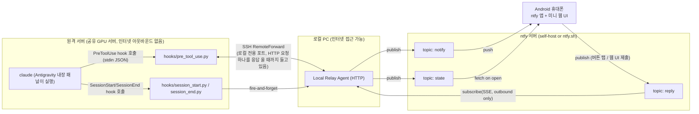

# Auto Yes Bot — 기술 명세 (v0.2, hooks 기반으로 전면 재설계)

> v0.1은 `claude`를 pty로 감싸서 터미널 화면을 읽는 방식으로 설계했었다. 실제
> 환경을 확인해보니 사용자는 Claude Code를 Antigravity의 **내장 에이전트 패널**로만
> 쓰고 있었고, 그 경우 `claude`는 `--output-format stream-json --input-format
> stream-json --permission-prompt-tool stdio`로 실행되어 **터미널 화면 자체가
> 없다**(구조화된 JSON/MCP 프로토콜로 Antigravity와 통신). 그래서 pty/화면감지
> 방식은 폐기하고, Claude Code의 공식 확장 지점인 **hooks**로 전면 재설계했다.

## 1. 배경

- Claude Code는 원격 GPU 서버(이하 "원격 서버")에서, **Antigravity 내장 에이전트
  패널**을 통해서만 실행된다 (평범한 터미널에서 `claude`를 직접 타이핑하는 경우는
  없음).
- 원격 서버는 여러 사용자가 같이 쓰는 공유 서버다. 사용자 개인 홈 디렉터리 밖(예:
  `/usr/local`, 다른 사용자의 홈)은 건드리면 안 된다 — root 권한도 없다.
- 로컬 PC에서 SSH로 이 원격 서버에 접속하는 구조이고, 로컬 PC는 자유롭게 인터넷에
  나갈 수 있지만 원격 서버 쪽은 개인 데몬을 상시 띄워두거나 인터넷에 직접 노출하는
  것을 피하고 싶어한다.
- 여러 프로젝트/세션이 동시에 떠 있을 수 있고, 자리를 비운 사이 권한 승인이
  필요한 상황이 생기면 휴대폰(Android)으로 알림을 받아 승인/거부하고 싶다.

## 2. 범위

**Goals**
- Claude Code의 도구 실행 권한 요청(`PreToolUse`)을 감지해서 휴대폰에 푸시로
  알린다.
- 알림에서 바로 승인/거부(1-tap), 또는 컴패니언 웹 UI에서 승인/거부.
- 세션별로 켜고 끌 수 있는 **자동 승인(auto-approve)** 모드 (기본값 OFF).
- 여러 세션(프로젝트)을 동시에 볼 수 있다.
- 원격 서버는 인바운드/아웃바운드 인터넷 접근이 전혀 필요 없다 (기존 SSH 연결
  위에 얹은 로컬 포트만 사용).
- root 권한이나 공유 경로 수정 없이, 사용자 홈/프로젝트 설정만으로 동작한다.

**Non-goals**
- **`AskUserQuestion`(메뉴/자유 텍스트로 되묻는 도구)에 대한 원격 응답은 지원하지
  않는다.** Claude Code의 공식 hooks API는 이 도구의 호출 자체에 대해 훅이
  전혀 발생하지 않고(PreToolUse/PostToolUse 대상 아님), 답변을 외부에서 주입할
  방법도 없다 (관련 기능 요청 이슈는 있으나 미구현). 이걸 되게 하려면 Antigravity의
  비공개 stream-json/MCP 프로토콜을 리버스엔지니어링해야 하는데, 버전마다 깨질
  위험이 크고 권장하지 않는다. → 이런 질문이 뜨면 사용자가 직접 Antigravity 앞에
  있어야 한다.
- iOS 지원 (Android만).
- "타임아웃 시 자동으로 허용/거부" 같은 자동화 (§9의 안전 기본값 참고 — 자동
  승인은 오직 사람이 명시적으로 켠 경우에만 동작).

## 3. 아키텍처 개요



핵심 아이디어 (v0.1과 동일하게 유지된 부분):
- **원격 서버는 SSH 터널 안쪽 `localhost` 포트에만 연결**한다.
- **로컬 PC(Local Relay Agent)만 인터넷과 통신**하며, 전부 **아웃바운드**다.
- **휴대폰도 ntfy 서버와만 통신**한다.

바뀐 부분: 원격 서버 쪽에서 상시 떠있는 프로세스(예전의 PTY Wrapper)가 이제
없다. `hooks/pre_tool_use.py`는 **PreToolUse가 일어날 때마다 딱 한 번 실행되고
끝나는 짧은 프로세스**다 — 실행되면 relay에 HTTP POST 요청 하나를 보내고, 그
요청의 응답이 올 때까지(=사람이 승인/거부하거나 auto-approve가 즉시 답할 때까지)
그냥 기다렸다가, 응답이 오면 그 결과를 stdout에 찍고 종료한다.

## 4. 컴포넌트

### 4.1 hooks/pre_tool_use.py (원격 서버)

- Claude Code의 `PreToolUse` hook으로 `.claude/settings.local.json`에 등록한다
  (§10). 이 hook은 감시 대상으로 지정한 도구(`watched_tools`, 기본 Bash/Write/
  Edit/MultiEdit/NotebookEdit/WebFetch)가 호출되기 직전에 매번 실행된다.
- stdin으로 `{session_id, tool_name, tool_input, cwd, tool_use_id, ...}` JSON을
  받는다 (Claude Code가 표준으로 제공).
- 동작:
  1. `tool_name`이 `watched_tools`에 없으면 **아무 출력 없이 즉시 종료** →
     Claude Code의 원래 권한 처리(대개 조용히 허용되거나, 필요하면 Antigravity가
     직접 물어봄)로 위임.
  2. 로컬 `hook_allowlist.json`의 패턴에 매치되면 역시 아무 출력 없이 종료 —
     폰에 알리지 않고 조용히 통과 (예: `git status`, `git diff` 같은 걸 매번
     묻지 않게).
  3. 그 외에는 Local Relay Agent에 `POST /pending`을 보내고, **응답이 올 때까지
     그 HTTP 요청 자체를 블로킹 상태로 기다린다** (`http_timeout_sec`, 기본
     3500초 — Claude Code hook 자체의 기본 타임아웃은 600초이므로, hook 등록
     시 `"timeout"` 값도 이보다 크게 맞춰줘야 한다. §10 참고).
  4. relay가 `{"decision": "allow"}` 또는 `{"decision": "deny"}`를 응답하면,
     `{"hookSpecificOutput": {"hookEventName": "PreToolUse", "permissionDecision":
     "allow"|"deny", ...}}`를 stdout에 출력하고 종료한다 — Claude Code가 이걸
     읽고 그대로 승인/거부한다.
  5. relay가 응답하지 않거나(네트워크 문제, relay 다운), timeout이 나거나,
     `"defer"`를 응답하면 **아무 출력도 하지 않고 종료**한다 → Claude Code의
     원래 동작(Antigravity에서 직접 물어보기)으로 자연스럽게 넘어간다. 즉 이
     시스템이 죽어도 "자동으로 허용됨" 같은 일은 절대 생기지 않는다.
- 의존성: Python 표준 라이브러리만 사용 (`json`, `urllib.request` 등) — 원격
  서버에 pip install이 전혀 필요 없다.

### 4.2 hooks/session_start.py, hooks/session_end.py (원격 서버)

- `SessionStart`/`SessionEnd` hook으로 등록. relay에 세션 등록/해제를
  fire-and-forget으로 알린다 (타임아웃 3초, 실패해도 무시 — Claude Code 동작에
  영향 없음). 이걸로 컴패니언 웹 UI의 "세션 목록"이 승인 요청이 없을 때도
  갱신된다.

### 4.2b hooks/user_prompt_submit.py, hooks/stop.py, hooks/notification.py — "확인 필요" 알림 (원격 서버)

`AskUserQuestion`은 여전히 원격으로 답할 수 없지만(§2 Non-goals), 최소한 "지금
뭔가에 막혀서 사람이 봐야 한다"는 신호는 다음 세 hook을 조합해서 추정한다:

- `UserPromptSubmit`(새 턴 시작), `Stop`(턴 정상 종료)을 각각 fire-and-forget으로
  relay에 알려서, relay가 세션별로 "마지막 턴 시작 시각"과 "마지막 턴 종료 시각"을
  들고 있게 한다.
- `Notification`(`notification_type` 포함, 특히 60초 무응답을 뜻하는
  `idle_prompt`)이 오면, relay는 다음 조건을 모두 만족할 때만 "🔔 확인 필요"
  알림을 보낸다:
  1. 이미 그 세션에 승인 대기(`pending_request_id`) 알림이 떠 있지 않다 (중복 방지).
  2. 마지막 턴 시작 시각이 마지막 턴 종료 시각보다 최신이다 (= 턴이 정상적으로
     끝나지 않은 채로 멈춰있다는 뜻 — `AskUserQuestion` 같은 것에 막혀있을 가능성).
- 반대로 턴이 이미 정상 종료된 뒤의 `idle_prompt`(그냥 사용자가 안 보고 있는 것)는
  알리지 않는다 — 이게 없으면 idle_prompt는 매 턴 끝날 때마다 거의 항상 발생해서
  알림이 스팸이 된다.
- 이건 확정적인 신호가 아니라 휴리스틱이다. `notification_type`이 정확히
  `AskUserQuestion` 대기를 가리키는 공식 매처는 문서화되어 있지 않기 때문에
  (§9 참고), 드물게 다른 이유의 60초 침묵에도 알림이 올 수 있다.

### 4.3 Local Relay Agent (로컬 PC)

- `daemon/relay.py`: aiohttp 기반 HTTP 서버. 라우트:
  - `POST /session_start`, `POST /session_end` — 세션 registry 갱신.
  - `POST /pending` — 요청을 등록하고 ntfy `notify` 토픽에 publish한 뒤,
    `asyncio.Future`를 만들어 **사람 응답이 올 때까지 이 HTTP 요청을 들고
    있는다** (`max_wait_sec` 초과 시 `{"decision": "defer"}`로 응답).
  - (dry-run 전용) `POST /dryrun/message` — 실제 ntfy 없이 로컬 테스트 시
    '폰 응답'을 주입.
- `auto_approve_store_path`에 세션별 auto-approve 상태를 JSON으로 저장해서
  재시작해도 유지된다.
- ntfy `reply` 토픽을 구독해서 폰의 응답을 받으면 해당 `request_id`의
  Future를 resolve한다.

### 4.4 ntfy 메시지 버스 및 컴패니언 웹 UI

v0.1과 동일한 3-토픽 구조(`notify`/`reply`/`state`)를 유지하되, 이제 승인
결정이 **항상 allow/deny 둘 중 하나**뿐이라 훨씬 단순해졌다:
- ntfy 알림에는 항상 승인/거부 두 버튼만 있고, relay가 publish 시점에 각
  버튼의 응답 body를 미리 서명해서 박아넣는다 (폰은 비밀키 없이 1-tap 가능).
- 컴패니언 웹 UI(`web/`)도 승인/거부 버튼만 있고, 자유 텍스트 입력칸은 없앴다
  (AskUserQuestion을 지원하지 않으므로 필요 없어짐). 세션 목록에서
  auto-approve 토글만 가능 (이건 웹 UI의 비밀키 서명이 필요).

## 5. 메시지 스키마 (JSON)

```jsonc
// PendingRequest (Local Relay Agent -> notify 토픽)
{
  "type": "pending_request",
  "request_id": "uuid",
  "session_id": "claude session_id",
  "session_label": "hostname:/path 또는 cwd",
  "tool_name": "Bash",
  "summary": "rm -rf ./build",   // Bash는 command, Write/Edit는 file_path 등
  "created_at": 1234567890,
  "auto_resolved": false          // true면 auto-approve가 이미 답한 것(참고용 로그)
}

// Reply (Phone/웹 UI -> reply 토픽 -> Local Relay Agent)
{
  "type": "reply",
  "request_id": "uuid",
  "decision": "allow" | "deny",
  "sig": "hmac(request_id|decision)"
}

// SetAutoApprove (웹 UI -> reply 토픽 -> Local Relay Agent)
{
  "type": "set_auto_approve",
  "session_id": "uuid | \"*\"",
  "enabled": true,
  "sig": "hmac(session_id|enabled)"
}

// StateSnapshot (Local Relay Agent -> state 토픽)
{
  "type": "state_snapshot",
  "sessions": [
    {"session_id": "...", "label": "...", "status": "idle|pending",
     "pending_request_id": "uuid|null", "auto_approve": false}
  ],
  "generated_at": 1234567890
}
```

## 6. 보안 모델

- `PendingRequest`(notify)는 서명이 필요 없다 — 읽을 수 있어도 어떤 행동을
  취할 권한이 생기지 않기 때문.
- `Reply`(allow/deny)와 `SetAutoApprove`만 `hmac_secret`으로 서명해야 유효
  처리된다. ntfy 알림의 승인/거부 버튼은 relay가 이미 알고 있는 고정값(allow,
  deny)에 대해 **relay가 미리 서명**해서 body에 박아두므로, 폰이 비밀키 없이도
  1-tap으로 유효한 응답을 만들 수 있다. 웹 UI의 auto-approve 토글만 브라우저가
  직접 서명해야 해서 비밀키 입력이 필요하다.
- ntfy.sh 공개 인스턴스를 쓸 경우 남는 리스크는 "토픽명을 아는 제3자가
  `summary`(예: 실행하려는 bash 커맨드)를 읽을 수 있다"는 기밀성 문제뿐이다 —
  위·변조(무결성)는 HMAC으로 막혀있다.

## 7. 실패/타임아웃 정책 (안전 기본값)

- 아무도 응답하지 않으면(사람도, auto-approve도): hook은 결국 timeout으로
  `{"decision":"defer"}`를 받고 **아무 출력 없이 종료** → Claude Code
  자체의 기본 동작(대개 Antigravity가 직접 물어보는 것)으로 자연스럽게
  넘어간다. 즉 "자동 거부"도 "자동 허용"도 절대 하지 않는다.
- `renotify_interval_sec`이 설정되어 있으면, 응답이 없는 동안 주기적으로
  같은 요청을 다시 notify한다.
- relay 프로세스가 죽어있으면: hook의 HTTP 요청이 연결 실패로 즉시(또는
  `http_timeout_sec` 후) 예외가 나고, 역시 아무 출력 없이 종료된다 → Claude
  Code는 평소처럼(Antigravity에서 직접 물어보는 것으로) 동작한다. 즉 이
  시스템 전체가 다운되어도 Claude Code 사용 자체는 막히지 않는다 (graceful
  degradation).

## 8. auto-approve 모드

- 세션별 on/off, 기본 OFF. 컴패니언 웹 UI에서 토글하면 relay 메모리 + 로컬
  파일(`auto_approve_store_path`)에 반영되고, **다음 `/pending` 호출부터**
  즉시 적용된다 (v0.1과 달리 살아있는 세션에 push할 필요가 없다 — 매 호출이
  독립적인 요청이므로).
- 켜져 있으면 relay는 `/pending`에서 사람에게 묻지 않고 즉시
  `{"decision":"allow"}`를 응답하되, `auto_resolved: true`로 notify에 기록을
  남겨 사후 확인이 가능하게 한다.
- `watched_tools`/`hook_allowlist.json`으로 이미 걸러지지 않은 모든 감시 대상
  도구에 적용된다 — "이 세션에서는 뭐든 물어보지 말고 다 허용" 스위치다.
  위험한 명령까지 자동 승인될 수 있음을 인지하고 켜야 한다.

## 9. 알려진 제약

- **`AskUserQuestion` 미지원** (§2 Non-goals). 메뉴/자유 텍스트 질문은 원격
  으로 답할 수 없고, Antigravity 앞에 직접 있어야 한다.
- **`watched_tools`/allowlist가 Claude Code 자체의 권한 규칙을 완벽히
  대체하지는 않는다.** 예를 들어 사용자가 Claude Code 설정에서 이미 광범위하게
  allow-list 해둔 Bash 명령도, 우리 hook의 `watched_tools`에 Bash가 포함돼
  있으면 매번 이 시스템을 거치게 된다 — 필요하면 `hook_allowlist.json`에
  같은 패턴을 추가해서 조용히 통과시켜야 한다.
- Claude Code hooks의 정확한 스키마/타임아웃 기본값은 버전에 따라 바뀔 수
  있으므로, 배포 후 실제 동작을 한 번은 직접 확인하는 것을 권장한다.

## 10. 배포 (개요, 상세는 README.md)

1. ntfy 준비: 랜덤 `topic_prefix`, `hmac_secret` 생성.
2. 로컬 PC: `daemon/relay.py` 상시 실행 (systemd user service 권장).
3. `~/.ssh/config`에 원격 서버 Host 항목에 `RemoteForward <port> 127.0.0.1:<relay_port>`.
4. 원격 서버: 이 리포지토리를 배포하고 `config/hook.json`, `config/hook_allowlist.json`
   작성. 프로젝트의 `.claude/settings.local.json`에 `config/settings.snippet.json`
   내용을 병합 — **root 권한도, claude 바이너리를 건드리는 것도 전혀 필요 없다.**
5. 컴패니언 웹 UI(`web/`)를 GitHub Pages 등 정적 호스팅에 올린다.
6. 휴대폰에 ntfy 앱 설치, `notify`/`state` 토픽 구독, 웹 UI 북마크.
